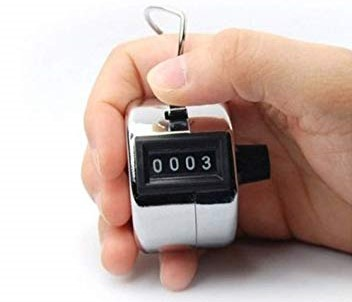
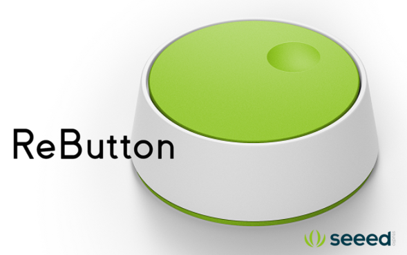

# IoT hand tally counter
IoT hand tally counter is a new type of tally counter using Azure IoT technologies. It will be a replacement of traditional counter like this picture. 

## Device 
IoT hand tally counter's base device is [Rebutton](https://seeedjp.github.io/ReButton/) which is simple button device with WIFI connectivity. Here is spec of Rebutton. 

 - MCU module:	MXCHIP EMW3166
 - Input:	1x Push button
 - Output:	1x RGB led
 - Extension:	1x I2C Grove connector (3.3V I/O)
 - Extras:	1x Jumper switch, 1x SWD pads, 1x UART for debugging
 - Power supply:	2x AAA Alkaline batteries (LR03)
 - Internal supply voltage: 3.3V
 - Dimension: 70mm*70mm*25mm